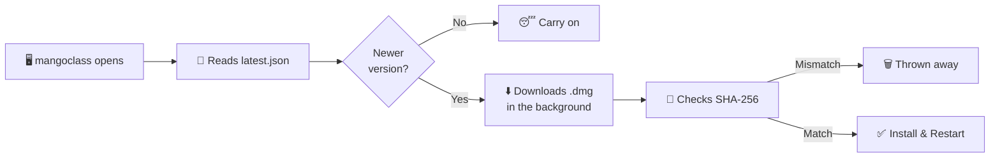

<div align="center">


# 🥭 mangoclass

**A macOS menu bar app that counts down your current class and shows what's next — with automatic A/B day rotation.**

Made by Mingyu 🧑‍💻

<br>


</div>

---

> [!NOTE]
> **mangoclass is completely free.** 🆓 Windows and Linux versions are in development —
> right now it's macOS only. Thank you for your patience! 🙏

---

## 📖 Contents

| | | |
| --- | --- | --- |
| [📥 Install](#-install) | [🎁 What it ships with](#-what-it-ships-with) | [👀 Using it](#-using-it) |
| [✏️ Editing schedules](#-editing-schedules) | [📸 Import from a picture](#-importing-from-a-picture) | [🔄 The cycle](#-the-cycle--more-than-just-a-and-b) |
| [🔁 Rotating classes](#-rotating-classes) | [🎪 Special days](#-special-days) | [🗓️ Special weeks](#-special-weeks) |
| [📆 Weekday rules](#-weekday-rules) | [🎉 Events](#-events) | [📊 Menu bar](#-menu-bar-display) |
| [🔔 Updates](#-versions-and-updates) | [🗂️ Where things live](#-where-things-live) | [⚖️ Licence](#-licence) |

---

## 📥 Install

### 🖱️ The easy way — no developer tools needed

Grab the `.dmg` from **[the Releases page](https://github.com/mannnnnnnngo/Mangoclass/releases)**,
open it, and drag mangoclass onto Applications.

> [!IMPORTANT]
> The first time you open it, macOS blocks it — the app isn't signed with a paid Apple
> developer account. Double-click mangoclass, press **Done** on the warning, then go to
> ** → System Settings → Privacy & Security**, scroll to the bottom, and press
> **Open Anyway**. Press **Open Anyway** once more to confirm. You only do this once. 🔓

---

## 🎁 What it ships with

A fresh install starts on a placeholder schedule so nothing is ever an empty screen: an A
and a B day of seven 45-minute classes with 5-minute passing periods, lunch in the middle
and a longer advisory at the end, running **8:25 AM → 4:00 PM**. Two special days
(Assembly, Half Day), two weekday rules — early-release Wednesday, late-start Friday —
and one event (House Shirts, every Friday) come switched on as working examples. The two
starter [rotating classes](#-rotating-classes) are there too — the Korean / KIS Reads block
and the Korean Social Studies day that moves each week.

All of it is meant to be replaced; none of it is anyone's real timetable. 🧪

> [!TIP]
> Everything you type is yours alone, kept in
> `~/Library/Application Support/ClassSchedule/schedule.json` and never included in a build.

---

## 👀 Using it

There's **no window and no Dock icon** — mangoclass lives in the menu bar at the top-right
of your screen. 📊

| Action | What you get |
| --- | --- |
| 🖱️ **Left-click** | The countdown panel |
| 🖱️ **Right-click** | A short menu — Edit Schedules, Quit |

The panel shows the current class name, hours/minutes/seconds remaining, a progress bar,
what's up next, and your whole day at a glance. Between classes the countdown switches to
time until the next one starts. ⏱️

### ✏️ Editing schedules

Settings → **Schedules**. Pick a day from the cycle chips at the top, then add classes with
a name, an optional room, and start/end times. Everything saves the moment you change it —
no save button. 💾

The **Room** column is free text and starts blank — type anything you want there (`204`,
`Lab 3`, `Gym — north`, a teacher's name). It shows up under the class name in the panel,
on the up-next line, and as a small chip in the day list. Leave it empty and nothing extra
is drawn.

⌨️ Times accept loose typing: `830`, `8:30`, `8:30 AM`, `3p`, `1430` all work. Without an
am/pm, 1–6 reads as afternoon and 7–12 as morning, which matches how school hours actually
fall. Anything unparseable snaps back to the previous value.

### 📸 Importing from a picture

**From a Picture** — under any day's class list, or next to **Add Day** — turns a photo of
a handout, a screenshot of the school portal, or a snap of the poster in the hallway into
classes. Drop the image on the window, choose a file, or take a screenshot with `⌃⌘⇧4` and
press **Paste**.

> [!NOTE]
> 🔒 It all runs **on your Mac** through Apple's Vision framework. Nothing is uploaded
> anywhere, ever.

It reads the picture **twice** 👁️👁️ — once from the original with spelling correction off,
which is kinder to times and room numbers, and once from an upscaled, contrast-boosted copy
with correction on, which is kinder to class names — then compares the two. Anything the
reads disagree on arrives marked, with the other read's answer one click away.

Nothing is saved until you press Import. The review screen puts the picture next to the
parsed rows, every field editable, and flags what it wasn't sure about:

| 🚩 Flag | What it means |
| --- | --- |
| ⚖️ **The two reads differ** | The reads produced different text. Take either one, or tick **Looks right**. |
| 🔮 **End time guessed** | Only a start time was on that line, so the class ends when the next one begins. |
| 💥 **Overlaps the class above** | Two classes claim the same minutes. |
| 🧮 **Several columns on one line** | Probably a week-at-a-glance grid — crop to one day and import again. |
| ❌ **Ends before it starts** / **No name found** | Has to be fixed by typing; it won't tick off. |

Untick any row to leave it out, or bin it. The button reads **Import 8 Classes** when
everything is settled and **Import Anyway** while something is still flagged — it never
blocks you, it just won't let a bad read through quietly.

A few things worth knowing:

- 🕐 **Missing am/pm is fine.** School days run forwards, so a list that reads `11:30`,
  `12:20`, `1:45` is worked out as morning, noon, afternoon by the order it's written in.
- 🚪 **Rooms are picked up** from a separate column, from `Room 204` / `Lab 3` wording, or
  from a bare number on the end of a name.
- 1️⃣ **One day per picture.** A weekly grid gets flagged rather than guessed at — crop it
  to a single day's column for a clean import.
- 📥 The **Add these classes to** picker at the bottom chooses where they land: any existing
  rotation or special day (replacing what's there or adding to it), or a brand new one.

### 🔄 The cycle — more than just A and B

**Add Day** extends the rotation. Two days gives you A/B; add a third and it becomes
A → B → C → A…, and so on for as many as you like. Each day gets its own name (rename `A`
to anything — `Red`, `Blue`, `Day 1`), its own 🎨 accent color, and its own schedule. The
arrows next to the name move a day earlier or later in the cycle.

Settings → **Calendar** pins the cycle: press a day name under **Set today to**, and every
other date is derived from that. Weekends are skipped entirely — Monday picks up exactly
where Friday left off. 🗓️

### 🔁 Rotating classes

Settings → **Schedules → Rotating Classes**. Some slots aren't the same thing every time
they come round. The third-from-last period is **Korean Language** on an A day and
**KIS Reads** on a B day. **Korean Social Studies** doesn't have a slot of its own at all —
it stands in for **Academic Support** one day a week, and the day it takes moves: Tuesday,
then the Monday after, then Tuesday again. 🔄

None of that fits in a timetable, because a timetable says what happens *every* time. So it
lives here instead, as rules laid over the top.

A rule finds one class on the day and **renames it**. That is the whole of what it can do.
It can't add a period, remove one, move the clock or write back into what's stored — same
promise as [weekday rules](#-weekday-rules) and [events](#-events). Switch every rule off
and your timetable is exactly what it always was. 🔒

| 🎛️ Rule | What it does |
| --- | --- |
| 🔤 **Different on each letter** | One slot, named per letter. Korean Language on A, KIS Reads on B. Fires every day. |
| 📆 **One day a week, rotating** | Stands in front of a class on one weekday a week, and the weekday moves on each week. |

**Setting one up:**

1. **Stands in for** — the class it takes over, picked from the chips of names already on
   your cycle or typed in. Matching ignores case and punctuation, so `Korean / KIS Reads`
   finds a period called `KIS Reads/Korean`. Next to it is the fallback: on a day that
   hasn't got that class, use the **3rd from last** class instead — or press the ⭕️ to
   match by name only. Special days are never touched by the position fallback; those were
   written out for one date on purpose.
2. **What it's called** — one box per letter for a letter rule, or a single class name for
   a rotating one. Leave a letter blank and that letter is left alone.
3. **The weeks** (rotating rules) — a row per week, with the weekday it lands on.
   Two rows is the default, `Tuesday` then `Monday`, so it alternates; add more rows for a
   three- or four-week cycle, or leave one row for the same weekday every week.
4. **Week 1 is** — any date in the week the list starts counting from.
5. **Only on** — restrict it to one letter, so a class that only exists on B days can't
   land on an A day that happens to fall on the right weekday.

> [!TIP]
> Why Tuesday and Monday? A B day falls on Monday, Wednesday and Friday one week and on
> Tuesday and Thursday the next. Alternating Tuesday and Monday is what keeps the class on
> a **B day every single time**, which is the actual rule — the weekday is just how you say
> it out loud.

Underneath each rotating rule is a preview of the **next few times it fires**, with the
letter each one lands on and whether it actually found a slot to take. A rule can be set up
perfectly and still do nothing, because the day it lands on hasn't got the class it stands
in for — better to see that here than to notice in a week. 👀

Rules are applied **in list order**, and the last one to claim a slot wins. The ⬆️⬇️ arrows
are how you settle which of two rules gets the same class. **Restore Starter Rules** puts
the original pair back without disturbing anything you've added.

### 🎪 Special days

Settings → **Special Days** holds reusable templates — Assembly, Half Day, Finals, whatever
— each with its own schedule, exactly like a rotation day. Building one doesn't put it on
the calendar; it just makes it available to assign.

Settings → **Calendar** assigns them. Click any date in the month grid, then pick what it
should be: **Normal**, one of your special days, or **No School**. The month grid shows the
result immediately, so you can see the whole term at a glance.

Each assigned date has one important switch — **Skip this day in the cycle**, off by default:

| Setting | What happens |
| --- | --- |
| 🔵 **Off** | The cycle keeps running underneath. Drop an Assembly on a C-day Monday → Monday shows the Assembly, Tuesday is still A, nothing downstream moves. The panel shows a small `C day underneath` note. |
| 🟣 **On** | The day is skipped by the cycle. That same Monday shows the Assembly, and the C day it displaced lands on Tuesday, pushing everything after back one slot. Use this for ❄️ snow days and 🎉 holidays, where school genuinely didn't happen. |

> [!TIP]
> Weekends never advance the cycle no matter what. You can assign a Saturday makeup day,
> even mark it as pausing, and the weekday rotation stays exactly where it was.

Dates you've assigned are listed under the calendar with a **Clear Past Dates** button to
tidy up old ones. 🧹

### 🗓️ Special weeks

Settings → **Special Days → Weeks**. A testing week isn't a special *day*. The letters keep
turning over normally, but for a few days in a row the classes on them aren't the usual
ones — and then it's over and everything goes back to how it was.

Press **Add Special Week**, name it, and set the dates it runs. Both ends are included, and
**This Week** / **Next Week** fill in Monday to Friday in one click. Stop the week a day
early and that day runs normally: a week that ends on Thursday hands Friday straight back.

Then give each letter its week. Every day in your cycle gets a card:

| | What it means |
| --- | --- |
| 🔵 **Runs its normal schedule this week** | Untouched. A week can reshape only the A days and leave B exactly as it is. |
| 🟣 **Replaced for this week only** | Press **Replace A Days** and you get a copy of your A day to edit — same classes, same rooms, same times, ready to change. Press **Back to Normal** to hand it back. |

The important part is that a week never edits your schedules. It keeps its own copy of the
days it stands in for, so your A and B days sit underneath it completely untouched — and
the morning after the last date, they're simply back. Nothing to undo, nothing to put right.
🔁

> [!NOTE]
> The cycle carries on underneath a special week, exactly like an unpaused special day. An
> A day is still an A day, so the Monday after a testing week picks up precisely where it
> would have anyway. The panel shows the week's name under the phase label, and the Calendar
> tab marks the dates it covers with an asterisk — `A*` — so you can see the range at a glance.

Weekday rules still apply during a special week: an early-release Wednesday is an early
release whatever the classes happen to be that week.

### 📆 Weekday rules

Settings → **Weekdays**. Some schools bend the clock on a particular weekday — an early
dismissal every Wednesday, a late start every Friday — while the classes themselves stay
exactly as they are. That can't be a rotation day, because a letter drifts across the week,
and it shouldn't be a special day, because you'd be assigning it date by date forever. So
it's a rule keyed to a weekday, applied on top of whichever letter lands there.

Pick a weekday, press **Add a Rule**, and switch on the parts you need:

| 🎛️ Knob | What it does |
| --- | --- |
| 🌅 **Start the day at** | The first class begins here and every class after it moves by the same amount. |
| 📏 **Make every class** | Sets each class's length. The gaps between them are kept as they are, so a 5-minute passing period stays 5 minutes. |
| 🏁 **Last class ends at** | The class still running at that time is cut short. Anything that would begin after it is dropped. |

They apply in that order — **resize → shift → land the finish time** — and each field opens
on what your schedule already does, so switching one on changes nothing until you change
the number. Underneath, a preview shows every day in the cycle as it will actually run,
with the old times struck through next to the new ones.

A rule only reshapes a rotation day. Special days are written for one date on purpose, so
they're left alone, and weekends never have classes to reshape. On a day a rule is running,
the panel shows its name under the phase label and the Calendar tab tags the date with it.

> [!NOTE]
> Nothing is copied: the names, rooms and running order come straight from the rotation day
> every time. Edit a class in **Schedules** and the weekday version follows along. 🔗

### 🎉 Events

Settings → **Events**. Not everything on a school day is a class. House Shirts, picture
day, a bake sale, a field trip — they're things you need to *know about* on a date, not
things that change what time your classes run.

So events sit **beside** the schedule, never inside it. Nothing an event does can add,
remove, move or reshape a class. Pile on as many as you like and your day still runs to the
exact minute it always did. 🔒

Give an event a name, a colour and an icon, then pick when it happens:

| 🔁 Repeat | What it does |
| --- | --- |
| 📅 **On dates I pick** | Just the days you tick. One-offs — a field trip, an away game. |
| 🗓️ **Every week** | Every Friday, every Tuesday. Keyed to the weekday, so it never drifts. |
| 🔤 **Every letter day** | Every A day, every C day. Rides along with the cycle, so it moves when a skipped day pushes everything along. |

Repeating events can be given a **Starts** and **Ends** date, so *"House Shirts every A day"*
can stop when the term does instead of running forever. They only fire on days that
actually have school, so nothing turns up over spring break. A date you ticked by hand
always counts — that one was your call.

An event can also carry a **time** ("8:00 AM – 8:30 AM"). That's printed on its chip and
nowhere else; it is **not** a period, and the class either side of it doesn't move. ⏱️

**Where they show up:**

- 🎛️ The **countdown panel** — a row of chips under the date, only on days that have any,
  with the first event's note underneath.
- 📅 The **Calendar** grid — each event **named** on its day, in its own colour. Two fit
  per cell and the rest roll up into a `+2 more`. A dot would only tell you that *something*
  was on; the point of a month view is not having to open the day to find out what. 🔤
- 📆 Pick a day in **Calendar** and there's an *Events on this day* box: type a name and
  press **Add** to make one right there, or tap an existing event's chip to switch it on
  or off for that date. Repeating events show greyed alongside, marked as coming from a
  rule.

> [!TIP]
> An event you're done with doesn't have to be deleted — switch **Show this event** off and
> it stays in the list without appearing anywhere. **Clear Past Dates** tidies one-off dates
> that have already been and gone. 🧹

### 📊 Menu bar display

Settings → **General** toggles the day name, the class name, and seconds in the menu bar
title. With everything on it reads like:

```
A · Period 2 · 42:15
```

On a special day the day name is the template's name instead — `Assembly · Period 1 · 12:04`.

---

## 🔔 Versions and updates

The current version is in the [`VERSION`](VERSION) file, and everything is stamped from it:
the number the app shows you, the name of the `.dmg`, and the release it came from can
never drift apart.

The numbering is `major.minor.patch` — a patch is a fix, a minor is a real upgrade, and a
major means everything's different now.

### ⚙️ How the app updates itself

**Every time mangoclass opens** it reads one small file —
[`updates/latest.json`](updates/latest.json) in this repository — and compares the version
in it against its own. A copy that's left open re-checks every nine minutes, and again
whenever the Mac wakes from sleep — so a release that goes out reaches everyone still
sitting in the menu bar **within about ten minutes**, without anyone clicking anything.
Once it's found something it stops asking, so you get told once, not every nine minutes.



If there's something newer:

1. 💬 A dialog says so, with the release notes. **Install & Restart**, **Later**, or
   **Skip This Version**.
2. 📦 The `.dmg` downloads in the background, and is checked against the SHA-256 in the
   manifest. A download that doesn't match is thrown away rather than installed.
3. 🔁 Installing writes a helper script, quits the app, replaces the bundle from the disk
   image, and reopens it. If the install location needs an administrator password, macOS
   asks for one — and the app is reopened as **you**, never as root.

While an update is waiting there's a 🟣 violet dot after the menu bar title, a strip at the
top of the countdown panel, and a dot on the Updates chip in Settings.

> [!IMPORTANT]
> **Your schedules are never part of this.** 🛡️ Only `mangoclass.app` is replaced.
> `schedule.json` isn't read, written, or migrated by any of it — and a copy of it is saved
> to `~/Library/Application Support/ClassSchedule/Updates/` before an install runs, just in
> case. The update preferences deliberately live in `UserDefaults` rather than in your
> schedule file, so that file's format never has to change for an update.

**When a new version does add something to the save file** — Events did, in 1.1 — it's
added the only way that's safe: every field is read with `decodeIfPresent` and a fallback,
so a `schedule.json` written by an older build opens unchanged and the new feature simply
starts out empty. Nothing is rewritten, nothing is migrated, and nothing you already built
moves. 🧷 And if a file ever *can't* be read, it's copied aside as
`schedule-unreadable-<date>.json` rather than being replaced by the starter schedule — a
timetable is too much work to lose to a bad byte.

Settings → **Updates** shows the version and build, when it last checked, what's new, and
three switches: check on open, download in the background, and install without asking (off
by default — installing restarts the app, which shouldn't happen mid-class 😅).

---

## 🗂️ Where things live

Schedules are stored as plain JSON at:

```
~/Library/Application Support/ClassSchedule/schedule.json
```

Editable by hand and easy to back up. **Reveal in Finder** in Settings → General jumps
straight to it. 📂

---

## ⚖️ Licence

mangoclass is **free to use** but **not open source**. It may not be redistributed,
modified, resold, reverse engineered, or presented as anyone else's work. The full terms
are in [`LICENSE`](LICENSE).

Copyright © 2026 Mingyu. All rights reserved.

---

<div align="center">

**Made with 🥭 by Mingyu**

🆓 Free forever · 🔒 Nothing leaves your Mac · 🪟🐧 Windows & Linux coming soon

</div>
