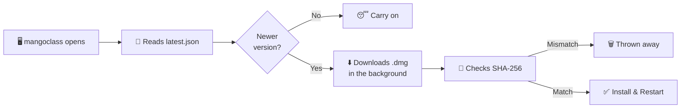

<div align="center">


# 🥭 mangoclass

**A macOS menu bar app that counts down your current class and shows what's next — with automatic A/B day rotation.**

Made by Mingyu 🧑‍💻

<br>


</div>

---

> [!NOTE]
> **mangoclass is completely free.** 🆓 Windows and Linux versions are in development —
> right now it's macOS only. Thank you for your patience! 🙏

---

## 📖 Contents

| | | |
| --- | --- | --- |
| [📥 Install](#-install) | [👀 Using it](#-using-it) | [✏️ Editing schedules](#-editing-schedules) |
| [📸 Import from a picture](#-importing-from-a-picture) | [🔄 The cycle](#-the-cycle--more-than-just-a-and-b) | [🎪 Special days](#-special-days) |
| [📆 Weekday rules](#-weekday-rules) | [🔔 Updates](#-versions-and-updates) | [🗂️ Where things live](#-where-things-live) |
| [🎨 The icon](#-the-icon) | [🧱 Source layout](#-source-layout) | [💅 Design](#-design) |

---

## 📥 Install

### 🖱️ The easy way — no developer tools needed

Grab the `.dmg` from **[the Releases page](https://github.com/mannnnnnnngo/Mangoclass/releases)**,
open it, and drag mangoclass onto Applications.

> [!IMPORTANT]
> The first time you open it, **right-click the app → Open**, then press **Open** in the
> dialog. Double-clicking gives you an "unidentified developer" warning with no way past
> it — the app isn't signed with a paid Apple developer account. Right-click → Open is
> Apple's built-in way around that, and you only have to do it once. 🔓

### ⌨️ From source

```bash
git clone https://github.com/mannnnnnnngo/Mangoclass.git
cd Mangoclass
./install.sh
```

Builds a universal app, puts it in `/Applications`, clears the quarantine flag, and
launches it. Needs Apple's command line tools (`xcode-select --install`).

| Flag | What it does |
| --- | --- |
| `./install.sh` | 🏗️ Build from this folder → `/Applications` |
| `./install.sh --user` | 🏠 Install to `~/Applications` — no password needed |
| `./install.sh --latest` | ⬇️ Skip building, download the newest release instead |
| `./install.sh --uninstall` | 🗑️ Remove the app (your schedules are kept) |

### 🔨 Build & run

```bash
./build.sh              # this Mac's architecture — fast, for working on it
./build.sh --universal  # arm64 + x86_64 — what gets shipped
open mangoclass.app
```

To keep it around, drag `mangoclass.app` into `/Applications`, then turn on
**Open at login** in Settings → General. To hand it to someone without developer tools,
`./package.sh` writes a `.dmg` they can just drag.

---

## 🎁 What it ships with

A fresh install starts on a placeholder schedule so nothing is ever an empty screen: an A
and a B day of seven 45-minute classes with 5-minute passing periods, lunch in the middle
and a longer advisory at the end, running **8:25 AM → 4:00 PM**. Two special days
(Assembly, Half Day) and two weekday rules — early-release Wednesday, late-start Friday —
come switched on as working examples.

All of it is meant to be replaced; none of it is anyone's real timetable. 🧪

> [!TIP]
> Everything you type is yours alone, kept in
> `~/Library/Application Support/ClassSchedule/schedule.json` and never included in a build.

---

## 👀 Using it

There's **no window and no Dock icon** — mangoclass lives in the menu bar at the top-right
of your screen. 📊

| Action | What you get |
| --- | --- |
| 🖱️ **Left-click** | The countdown panel |
| 🖱️ **Right-click** | A short menu — Edit Schedules, Quit |

The panel shows the current class name, hours/minutes/seconds remaining, a progress bar,
what's up next, and your whole day at a glance. Between classes the countdown switches to
time until the next one starts. ⏱️

### ✏️ Editing schedules

Settings → **Schedules**. Pick a day from the cycle chips at the top, then add classes with
a name, an optional room, and start/end times. Everything saves the moment you change it —
no save button. 💾

The **Room** column is free text and starts blank — type anything you want there (`204`,
`Lab 3`, `Gym — north`, a teacher's name). It shows up under the class name in the panel,
on the up-next line, and as a small chip in the day list. Leave it empty and nothing extra
is drawn.

⌨️ Times accept loose typing: `830`, `8:30`, `8:30 AM`, `3p`, `1430` all work. Without an
am/pm, 1–6 reads as afternoon and 7–12 as morning, which matches how school hours actually
fall. Anything unparseable snaps back to the previous value.

### 📸 Importing from a picture

**From a Picture** — under any day's class list, or next to **Add Day** — turns a photo of
a handout, a screenshot of the school portal, or a snap of the poster in the hallway into
classes. Drop the image on the window, choose a file, or take a screenshot with `⌃⌘⇧4` and
press **Paste**.

> [!NOTE]
> 🔒 It all runs **on your Mac** through Apple's Vision framework. Nothing is uploaded
> anywhere, ever.

It reads the picture **twice** 👁️👁️ — once from the original with spelling correction off,
which is kinder to times and room numbers, and once from an upscaled, contrast-boosted copy
with correction on, which is kinder to class names — then compares the two. Anything the
reads disagree on arrives marked, with the other read's answer one click away.

Nothing is saved until you press Import. The review screen puts the picture next to the
parsed rows, every field editable, and flags what it wasn't sure about:

| 🚩 Flag | What it means |
| --- | --- |
| ⚖️ **The two reads differ** | The reads produced different text. Take either one, or tick **Looks right**. |
| 🔮 **End time guessed** | Only a start time was on that line, so the class ends when the next one begins. |
| 💥 **Overlaps the class above** | Two classes claim the same minutes. |
| 🧮 **Several columns on one line** | Probably a week-at-a-glance grid — crop to one day and import again. |
| ❌ **Ends before it starts** / **No name found** | Has to be fixed by typing; it won't tick off. |

Untick any row to leave it out, or bin it. The button reads **Import 8 Classes** when
everything is settled and **Import Anyway** while something is still flagged — it never
blocks you, it just won't let a bad read through quietly.

A few things worth knowing:

- 🕐 **Missing am/pm is fine.** School days run forwards, so a list that reads `11:30`,
  `12:20`, `1:45` is worked out as morning, noon, afternoon by the order it's written in.
- 🚪 **Rooms are picked up** from a separate column, from `Room 204` / `Lab 3` wording, or
  from a bare number on the end of a name.
- 1️⃣ **One day per picture.** A weekly grid gets flagged rather than guessed at — crop it
  to a single day's column for a clean import.
- 📥 The **Add these classes to** picker at the bottom chooses where they land: any existing
  rotation or special day (replacing what's there or adding to it), or a brand new one.

### 🔄 The cycle — more than just A and B

**Add Day** extends the rotation. Two days gives you A/B; add a third and it becomes
A → B → C → A…, and so on for as many as you like. Each day gets its own name (rename `A`
to anything — `Red`, `Blue`, `Day 1`), its own 🎨 accent color, and its own schedule. The
arrows next to the name move a day earlier or later in the cycle.

Settings → **Calendar** pins the cycle: press a day name under **Set today to**, and every
other date is derived from that. Weekends are skipped entirely — Monday picks up exactly
where Friday left off. 🗓️

### 🎪 Special days

Settings → **Special Days** holds reusable templates — Assembly, Half Day, Finals, whatever
— each with its own schedule, exactly like a rotation day. Building one doesn't put it on
the calendar; it just makes it available to assign.

Settings → **Calendar** assigns them. Click any date in the month grid, then pick what it
should be: **Normal**, one of your special days, or **No School**. The month grid shows the
result immediately, so you can see the whole term at a glance.

Each assigned date has one important switch — **Skip this day in the cycle**, off by default:

| Setting | What happens |
| --- | --- |
| 🔵 **Off** | The cycle keeps running underneath. Drop an Assembly on a C-day Monday → Monday shows the Assembly, Tuesday is still A, nothing downstream moves. The panel shows a small `C day underneath` note. |
| 🟣 **On** | The day is skipped by the cycle. That same Monday shows the Assembly, and the C day it displaced lands on Tuesday, pushing everything after back one slot. Use this for ❄️ snow days and 🎉 holidays, where school genuinely didn't happen. |

> [!TIP]
> Weekends never advance the cycle no matter what. You can assign a Saturday makeup day,
> even mark it as pausing, and the weekday rotation stays exactly where it was.

Dates you've assigned are listed under the calendar with a **Clear Past Dates** button to
tidy up old ones. 🧹

### 📆 Weekday rules

Settings → **Weekdays**. Some schools bend the clock on a particular weekday — an early
dismissal every Wednesday, a late start every Friday — while the classes themselves stay
exactly as they are. That can't be a rotation day, because a letter drifts across the week,
and it shouldn't be a special day, because you'd be assigning it date by date forever. So
it's a rule keyed to a weekday, applied on top of whichever letter lands there.

Pick a weekday, press **Add a Rule**, and switch on the parts you need:

| 🎛️ Knob | What it does |
| --- | --- |
| 🌅 **Start the day at** | The first class begins here and every class after it moves by the same amount. |
| 📏 **Make every class** | Sets each class's length. The gaps between them are kept as they are, so a 5-minute passing period stays 5 minutes. |
| 🏁 **Last class ends at** | The class still running at that time is cut short. Anything that would begin after it is dropped. |

They apply in that order — **resize → shift → land the finish time** — and each field opens
on what your schedule already does, so switching one on changes nothing until you change
the number. Underneath, a preview shows every day in the cycle as it will actually run,
with the old times struck through next to the new ones.

A rule only reshapes a rotation day. Special days are written for one date on purpose, so
they're left alone, and weekends never have classes to reshape. On a day a rule is running,
the panel shows its name under the phase label and the Calendar tab tags the date with it.

> [!NOTE]
> Nothing is copied: the names, rooms and running order come straight from the rotation day
> every time. Edit a class in **Schedules** and the weekday version follows along. 🔗

### 📊 Menu bar display

Settings → **General** toggles the day name, the class name, and seconds in the menu bar
title. With everything on it reads like:

```
A · Period 2 · 42:15
```

On a special day the day name is the template's name instead — `Assembly · Period 1 · 12:04`.

---

## 🔔 Versions and updates

The version is in **one place** — the `VERSION` file — and everything else is stamped from
it: `build.sh` writes it into the app bundle, `package.sh` names the `.dmg` after it, and
`release.sh` publishes it. Right now it's **0.1.0**.

The numbering is `major.minor.patch`:

| Change | Command | 0.1.0 becomes |
| --- | --- | --- |
| 🩹 A fix, a tweak, one more thing | `./release.sh patch` | `0.1.1` |
| ✨ A real upgrade | `./release.sh minor` | `0.2.0` |
| 🚀 Everything's different now | `./release.sh major` | `1.0.0` |

### ⚙️ How the app updates itself

**Every time mangoclass opens** it reads one small file —
[`updates/latest.json`](updates/latest.json) in this repository — and compares the version
in it against its own. It also re-checks every six hours if the Mac is left running.



If there's something newer:

1. 💬 A dialog says so, with the release notes. **Install & Restart**, **Later**, or
   **Skip This Version**.
2. 📦 The `.dmg` downloads in the background, and is checked against the SHA-256 in the
   manifest. A download that doesn't match is thrown away rather than installed.
3. 🔁 Installing writes a helper script, quits the app, replaces the bundle from the disk
   image, and reopens it. If the install location needs an administrator password, macOS
   asks for one — and the app is reopened as **you**, never as root.

While an update is waiting there's a 🟣 violet dot after the menu bar title, a strip at the
top of the countdown panel, and a dot on the Updates chip in Settings.

> [!IMPORTANT]
> **Your schedules are never part of this.** 🛡️ Only `mangoclass.app` is replaced.
> `schedule.json` isn't read, written, or migrated by any of it — and a copy of it is saved
> to `~/Library/Application Support/ClassSchedule/Updates/` before an install runs, just in
> case. The update preferences deliberately live in `UserDefaults` rather than in your
> schedule file, so that file's format never has to change for an update.

Settings → **Updates** shows the version and build, when it last checked, what's new, and
three switches: check on open, download in the background, and install without asking (off
by default — installing restarts the app, which shouldn't happen mid-class 😅).

### 📤 Publishing one

Three ways in, all doing the same thing. 🥭

**🟢 The button — no Mac needed.**
[Actions → Release → **Run workflow**](https://github.com/mannnnnnnngo/Mangoclass/actions/workflows/release.yml),
type `patch` and what changed, press the green button. GitHub builds it on one of its own
Macs and the release is up in about five minutes. Free, because macOS runners cost nothing
on public repositories.

**🖱️ Double-click a launcher.** `Release.command` on a Mac, `Release.cmd` on Windows —
both ask what kind of release this is and take it from there. The Mac one builds the
`.dmg` and opens it so you can try it before anything is published. The Windows one
can't build the app, so it presses the Actions button for you and then follows the build
all the way to the finished release without you leaving the window; it needs the GitHub
CLI once (`winget install --id GitHub.cli`, then `gh auth login`).

Neither launcher is in this repository — they live on the machines releases go out from,
and `Release.cmd` carries everything it needs inside the one file, so it works from
wherever you keep it.

**⌨️ Or by hand:**

```bash
./release.sh minor --notes "Weekday rules can now do lunch."
```

That bumps `VERSION`, rebuilds universal, writes `dist/mangoclass-0.2.0.dmg`, checksums it,
and rewrites `updates/latest.json` to point at it. **Nothing has left the Mac at that
point** — it prints the git and `gh` commands to run. Add `--publish` and it commits, tags
`v0.2.0`, pushes, and creates the GitHub release with the `.dmg` attached itself.

The moment that push lands, every copy of mangoclass offers the new version the next time
it opens. (`raw.githubusercontent.com` caches for about five minutes, so the very first
check after a release may still see the old one.)

> [!NOTE]
> Updates are only ever read from
> `https://raw.githubusercontent.com/mannnnnnnngo/Mangoclass/main/updates/latest.json`.
> Nothing about the Mac is sent — the app makes one GET request and, if there's something
> new, one more for the `.dmg`. 🔐

---

## 🗂️ Where things live

Schedules are stored as plain JSON at:

```
~/Library/Application Support/ClassSchedule/schedule.json
```

Editable by hand and easy to back up. **Reveal in Finder** in Settings → General jumps
straight to it. 📂

---

## 🎨 The icon

The app icon is your `mangoclass.png` drawing, cropped to the "I HATE SCHOOL" text plus the
head (cut at the neck) and centered on a white rounded square using Apple's icon grid.

To change it, drop a new drawing at `Icon/mangoclass.png` and rebuild — `build.sh`
regenerates the icon automatically whenever the drawing is newer than the built `.icns`. Or
run it by hand:

```bash
swift Tools/make_icon.swift
```

The crop region lives in `cropRect` at the top of `Tools/make_icon.swift`, in source-image
pixels measured from the top-left. `Icon/AppIcon-1024.png` is written alongside the `.icns`
so you can eyeball the result without digging into the bundle.

> [!TIP]
> If Finder keeps showing a stale icon after a rebuild, `touch mangoclass.app` nudges
> LaunchServices. 🪄

---

## 🧱 Source layout

| 📄 File | Purpose |
| --- | --- |
| `Sources/Models.swift` | `Period`, `RotationDay`, `SpecialDay`, `DateOverride`, `WeekdayShape`, `AppData` + save-format migration |
| `Sources/Rotation.swift` | Weekday counting, cycle position, and resolving a date to what it actually is |
| `Sources/Store.swift` | Loads/saves JSON, owns all edits |
| `Sources/Engine.swift` | Turns "now + schedules" into current class, next class, and seconds remaining |
| `Sources/DesignSystem.swift` | Colors, type, pills, cards — the tokens from `design.md` |
| `Sources/Inputs.swift` | Time parsing, text/time fields, toggle |
| `Sources/ScheduleImport.swift` | Reads a picture twice with Vision, parses rows into classes, cross-checks the two reads |
| `Sources/ImportView.swift` | The drop zone and the review-before-saving sheet |
| `Sources/PanelView.swift` | The countdown panel, plus the 1-second ticker |
| `Sources/Panel.swift` | Borderless panel window that hosts it |
| `Sources/SettingsView.swift` | Schedules, special days, calendar, general — and the window host |
| `Sources/App.swift` | Status item, menu bar title, click handling |
| `Sources/Updater.swift` | Version numbers, the update check, download, checksum, and the swap-and-relaunch script |
| `Sources/UpdateView.swift` | The panel's update strip and the Updates tab |
| `VERSION` | The version number. Everything else is stamped from this |
| `updates/latest.json` | What the app reads to find out whether it's out of date |
| `release.sh` | Bumps the version, builds the `.dmg`, writes the manifest, publishes the release |
| `LICENSE` | Free to use, all rights reserved — the source being readable isn't permission to reuse it |
| `.github/workflows/release.yml` | The same release, run on GitHub's Mac from the Actions tab. No Mac of your own needed |
| `Tools/make_icon.swift` | Turns `Icon/mangoclass.png` into `Icon/AppIcon.icns` |
| `build.sh` | Compiles the app bundle — `--universal` for arm64 + x86_64 |
| `install.sh` | Build, install to `/Applications`, clear quarantine, launch — also `--user` and `--uninstall` |
| `package.sh` | Wraps a universal build in a `.dmg` with instructions, for people without developer tools |

<details>
<summary>🔬 <b>How the tricky bits actually work</b></summary>

<br>

**The importer** groups Vision's text boxes into rows by how much of their height they
share, so a table arrives as rows of cells rather than scattered fragments. Times are found
by regex — a lost colon (`11.30`, `1130`) still reads — and morning/afternoon is settled by
walking the day forwards and taking the earliest reading that doesn't run backwards. The
two reads are lined up by start time, within twelve minutes, and every mismatch becomes a
flag on the row instead of a silent choice.

**Weekday rules** are applied at resolve time rather than stored as schedules, so they're a
*view* of the rotation day rather than a second copy of it — which is why editing a class
updates every weekday it appears on. Only one live rule per weekday is ever used, so two
rules can't fight over the same day.

**Rotation** works by counting weekdays since a fixed reference Monday, where weekends share
the index of the Friday before them. A date's position in the cycle is that index minus the
number of rotation-pausing days before it; the day is then picked by taking that position
modulo the cycle length, relative to the anchor. That's why weekends can't shift anything,
why pausing days push the cycle forward by exactly one slot, and why dates *before* the
anchor resolve correctly too.

</details>

---

## 💅 Design

The interface follows [`design.md`](design.md):

| Token | Value |
| --- | --- |
| 🎨 Canvas | White |
| ⚫ Primary actions | Ink-black `#202020` |
| 💊 Corners | Full-radius pills on every button and badge |
| ➖ Separation | 1px `#e8e8e8` hairlines instead of drop shadows |
| 🔤 Micro-labels | Wide-tracked uppercase mono |

The menu bar panel is a borderless custom window rather than an `NSPopover`, so there's no
system arrow and no vibrancy material.

The brand typefaces (Plus Jakarta Sans, Sometype Mono) aren't installed, so each role
resolves through its documented substitute chain and falls back to the system font — and
the negative tracking eases off automatically when falling back, since the system font is
narrower. To use the real faces, drop the font files into `Fonts/` and rebuild: `build.sh`
copies them into the bundle and the app registers them at launch. Settings → General shows
which fonts are actually in use.

---

## ⚖️ Licence

mangoclass is **free to use** but **not open source**. The code being readable here isn't
permission to reuse it — it may not be redistributed, modified, resold, reverse
engineered, or presented as anyone else's work. The full terms are in
[`LICENSE`](LICENSE).

Copyright © 2026 Mingyu. All rights reserved.

---

<div align="center">

**Made with 🥭 by Mingyu**

🆓 Free forever · 🔒 Nothing leaves your Mac · 🪟🐧 Windows & Linux coming soon

</div>
